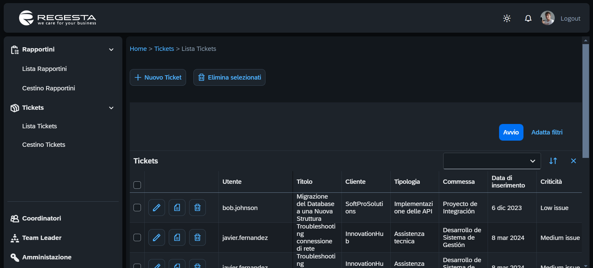
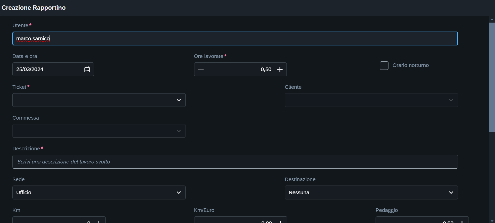
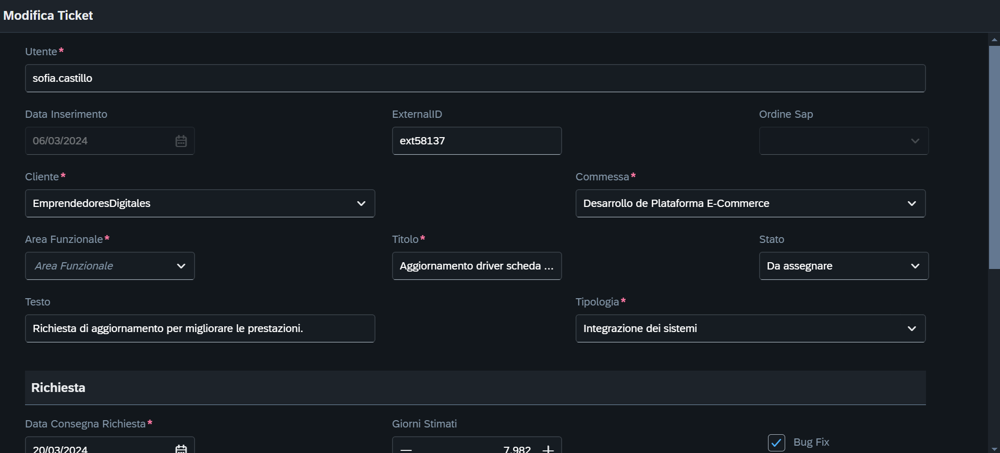
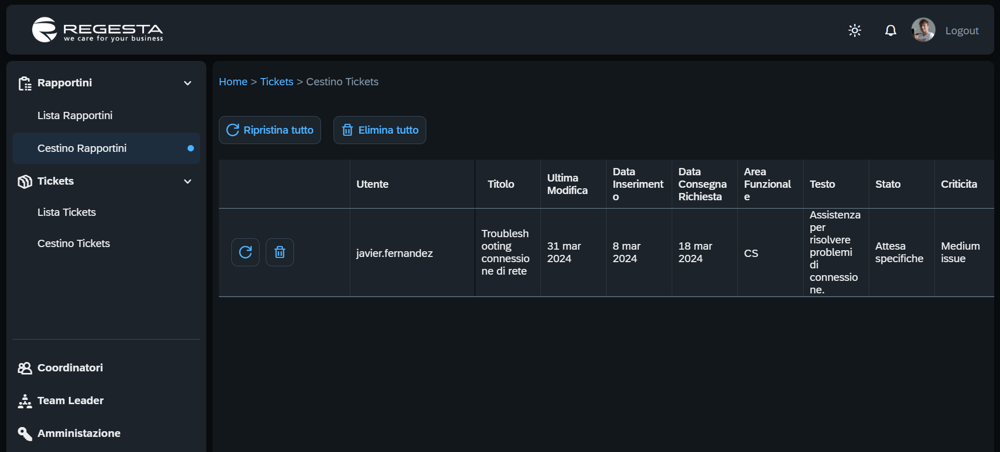
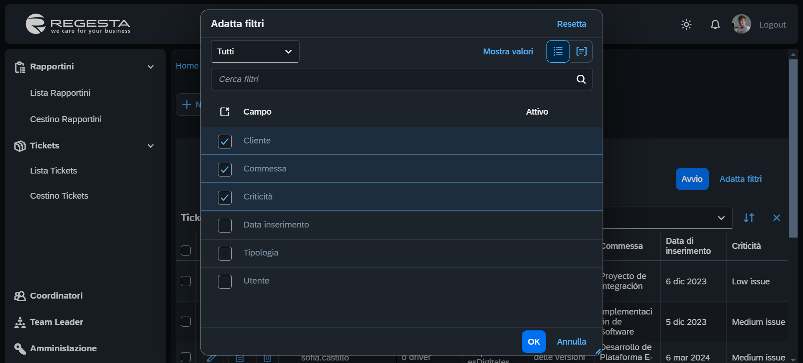
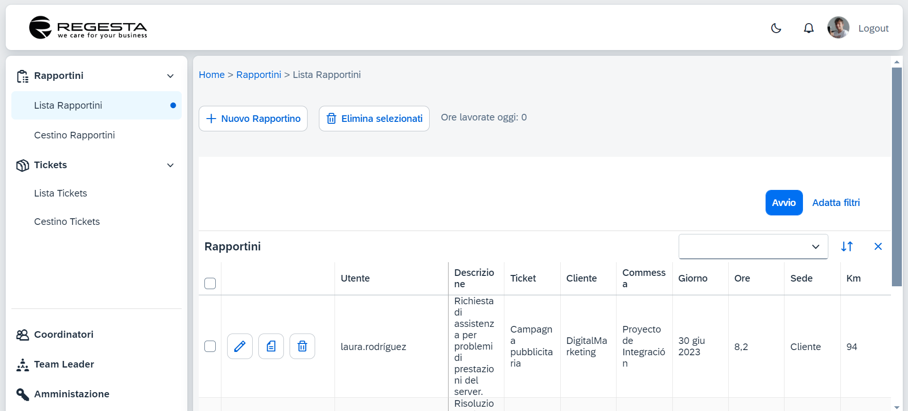

<h1 align="center">

</h1>

## Introduzione

Questo repository contiene il risultato del periodo di stage svolto da alcuni studenti della quarta dell'IIS Castelli presso l'azienda Regesta S.P.A, situata in Via Antonio Panigada, 15, 25126 Brescia BS, Italia, nel periodo da fine giugno a inizio luglio 2023.

Durante lo stage, gli studenti partecipanti sono stati divisi in due gruppi. Un gruppo si è dedicato allo sviluppo di un'applicazione web per la gestione dei ticket aziendali, mentre l'altro gruppo ha lavorato su un'applicazione web per la gestione dei rapportini aziendali.

Entrambi i progetti sono basati sulle vecchie applicazioni web dell'azienda, con l'obiettivo di modernizzarle e renderle responsive.

Dopo il periodo di stage, sono stati organizzati incontri durante l'anno scolastico successivo per unire il lavoro dei due gruppi e portare a termine il progetto.

<details open>
<summary>
Funzionalità
</summary> <br />
<ul>
<li>Creazione di nuovi ticket o rapportini</li>
<li>Visualizzazione della lista dei ticket o rapportini</li>
<li>Duplicazione di ticket o rapportini esistenti</li>
<li>Modifica di ticket o rapportini esistenti</li>
<li>Eliminazione di ticket o rapportini</li>
<li>Gestione del cestino per ticket o rapportini eliminati</li>
<li>Ripristino di ticket o rapportini dal cestino</li>
</u> <br />
<p align="center">

&nbsp;

</p>
<p align="center">

&nbsp;

</p> 
<p align="center">

&nbsp;

</p>
</details>

## Utilizzo
Per utilizzare questo progetto, segui i passaggi seguenti:
<details open>
<summary>
Prerequisiti
</summary> <br />
<p>Prima di iniziare, assicurati di avere installati i seguenti prerequisiti:</p>
<ul>
<li>Un editor di codice per eseguire il progetto (ad esempio, Visual Studio Code)</li>
<li>Git</li>
<li>Node.js</li>
</ul>
</details>
<details open>
<summary>
Esecuzione dell'applicazione
</summary> <br />
1. Per scaricare il progetto, puoi clonare la repository utilizzando il seguente comando da terminale:

```shell
git clone https://github.com/Halid04/Regesta-Rapportini.git
```
Oppure, puoi scaricare il file ZIP della [repository da GitHub](https://github.com/Halid04/Regesta-Rapportini) e estrarlo sul tuo computer. <br /> <br />
2. Dopo aver scaricato il progetto, accedi alla directory del progetto tramite il terminale e installa tutte le dipendenze necessarie eseguendo il seguente comando:
```shell
npm install
```
<br />
3. Una volta completata l'installazione delle dipendenze, puoi avviare l'applicazione eseguendo il seguente comando:

```shell
npm run start
```

L'applicazione sarà quindi disponibile all'indirizzo http://localhost:4004.
</details>

## Tecnologie principali usate

- [SAPUI5](https://sapui5.hana.ondemand.com/sdk/#/)
- [CAP](https://cap.cloud.sap/docs/)
- [CDS](https://cap.cloud.sap/docs/cds/)

## Contributors

[//]: contributor-faces
<a href="https://github.com/Halid04"></a>
<a href="https://github.com/Ai2045"></a>
<a href="https://github.com/PazzoMatto"></a>
<a href="https://github.com/steGiro05"></a>
<a href="https://github.com/Alexagnelli05"></a>
<a href="https://github.com/MarcelloMerenda"></a>
<a href="https://github.com/GiorgioAderenti-Reg"></a>
<a href="https://github.com/Lovedeep05"></a>
<a href="https://github.com/NabilTouri"></a>
<a href="https://github.com/SarnicoMarco"></a>
<a href="https://github.com/Tellyn"></a>
<a href="https://github.com/Valentinatruppia"></a>

[//]: contributor-faces
